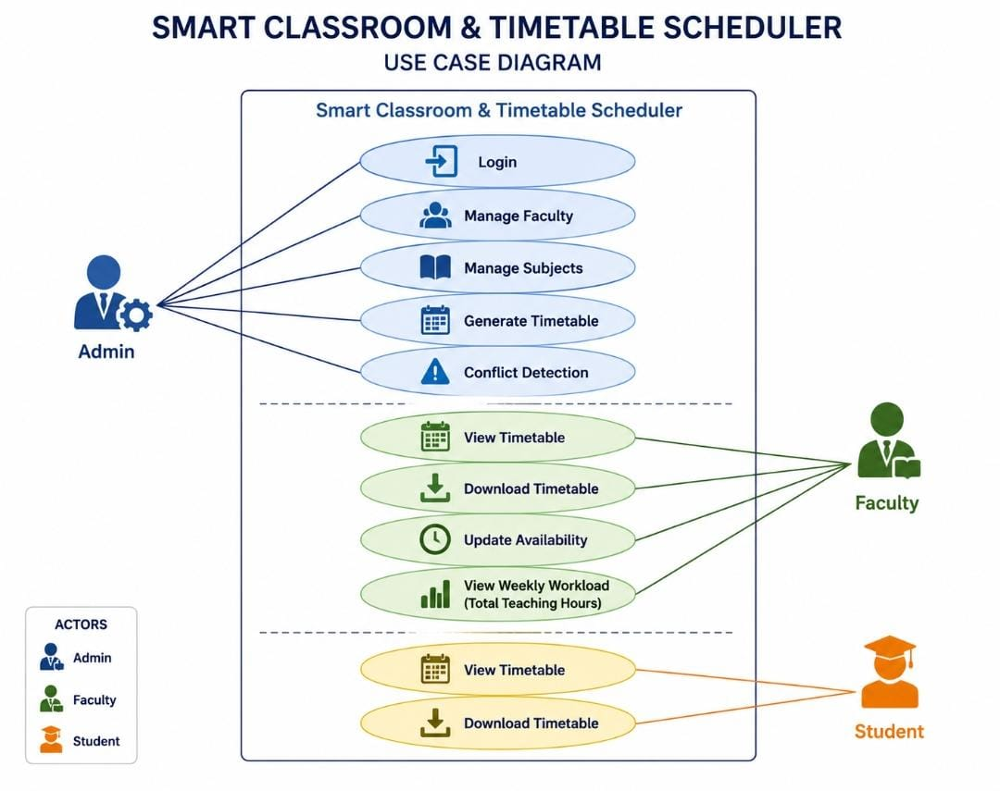
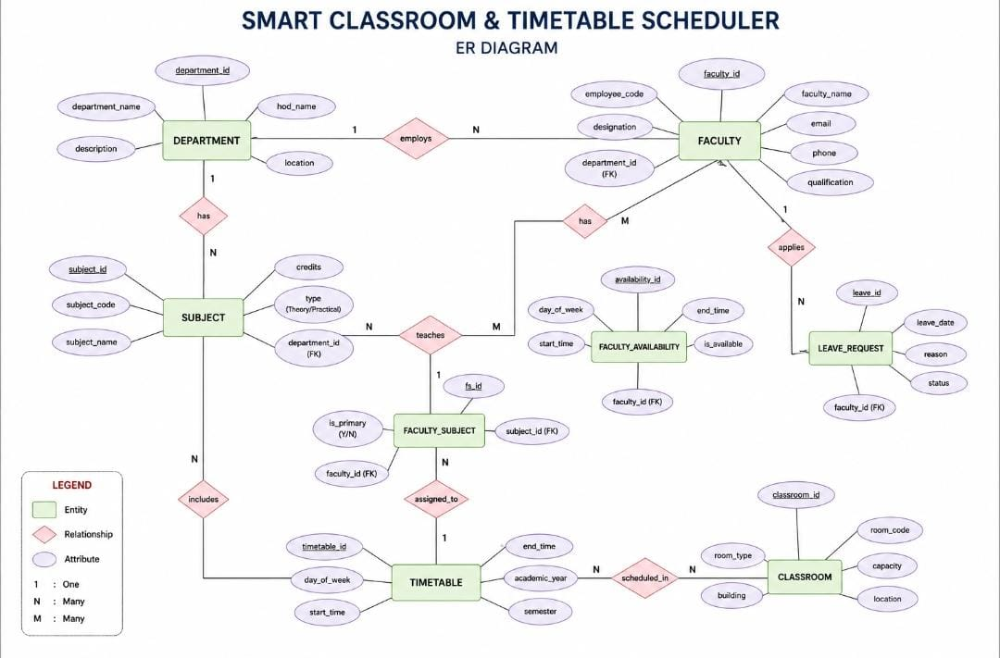

# Smart Classroom & Timetable Scheduler

## Project Overview

The **Smart Classroom & Timetable Scheduler** is a web-based application developed to automate the timetable generation process in educational institutions. It helps manage faculty, subjects, classrooms, and schedules efficiently while reducing manual work and scheduling conflicts. The system also allows faculty and students to view their timetables easily through a user-friendly interface.

## Problem Statement

In many educational institutions, timetable preparation is done manually, which is time-consuming and prone to scheduling conflicts. Managing faculty, subjects, and classrooms manually may lead to errors and inefficient scheduling. This project aims to automate the timetable generation process, making timetable management more accurate, efficient, and user-friendly.

## Project Objectives

- To automate the timetable generation process.
- To reduce faculty and classroom scheduling conflicts.
- To manage faculty, subjects, and classrooms efficiently.
- To provide easy timetable access for faculty and students.
- To improve the accuracy and efficiency of timetable management.

## Module List

- Login Module
- Dashboard
- Faculty Management
- Subject Management
- Classroom Management
- Timetable Generation
- Timetable View

## Use Case Diagram

The Use Case Diagram illustrates the interactions between the three main users—Admin, Faculty, and Student—and the Smart Classroom & Timetable Scheduler system. It represents the key functionalities available to each user, including timetable generation, timetable viewing, faculty management, subject management, and login.



## Table List

| Table Name | Description |
|------------|-------------|
| Users | Stores login credentials and user roles (Admin, Faculty, Student). |
| Faculty | Stores faculty details. |
| Student | Stores student information. |
| Department | Stores department details. |
| Subject | Stores subject information. |
| Classroom | Stores classroom details. |
| Timetable | Stores generated timetable schedules. |

## Entity Relationship (ER) Diagram

The ER Diagram represents the database structure of the **Smart Classroom & Timetable Scheduler**. It illustrates the entities, attributes, and relationships involved in the system, including **Department, Faculty, Subject, Faculty Availability, Faculty Subject, Classroom, Leave Request, and Timetable**.



## SQL Schema

The SQL schema defines the database structure for the **Smart Classroom & Timetable Scheduler**. It includes tables for managing users, departments, faculty, subjects, classrooms, timetables, and leave requests.

```sql
CREATE TABLE Department (...);
CREATE TABLE Faculty (...);
CREATE TABLE Subject (...);
CREATE TABLE Faculty_Subject (...);
CREATE TABLE Faculty_Availability (...);
CREATE TABLE Classroom (...);
CREATE TABLE Timetable (...);
CREATE TABLE Leave_Request (...);
```

## Page Layout

The page layout was designed to provide a simple, user-friendly, and responsive interface. It includes the Login Page, Dashboard, Faculty Management, Subject Management, Classroom Management, Timetable Generation, and Timetable View pages.

## UI Screens

The user interface (UI) screens were designed to provide a clean, responsive, and user-friendly experience. The design includes the Login Page, Dashboard, Faculty Management, Subject Management, and Timetable pages for easy navigation and efficient timetable management.

## UI Prototype

The UI prototype was designed to visualize the overall structure and user interface of the Smart Classroom & Timetable Scheduler before development. It includes the Login Page, Dashboard, Faculty Management, Subject Management, and Timetable screens.

## Design Approval

The project design was reviewed and finalized. The UI prototype, database design, Use Case Diagram, and ER Diagram were verified before starting the development phase.

## Frontend Environment Setup

The frontend development environment was successfully configured using React.js. The project structure was initialized and prepared for developing the user interface of the Smart Classroom & Timetable Scheduler.

## Login Page Development

The login page was developed to provide secure access to the Smart Classroom & Timetable Scheduler. Users can log in using their credentials and access the system based on their roles.

## Registration Module

The registration module was developed to allow the administrator to add and manage user accounts. It helps maintain user information securely within the system.

## Dashboard Development

The dashboard was developed to provide a centralized view of the system. It allows users to access different modules such as Faculty Management, Subject Management, Classroom Management, and Timetable Generation.

## CRUD Form Development

CRUD forms were developed to create, view, update, and delete records for faculty, subjects, classrooms, and departments through a user-friendly interface.

## Data Listing

The data listing page was developed to display faculty, subjects, classrooms, and timetable records in a structured table with search functionality.

## Frontend Review

The frontend modules were reviewed and tested to ensure proper navigation, responsive design, and smooth user interaction before backend integration.

## Backend Setup

The backend environment was configured using Python FastAPI. The project structure was initialized to develop APIs, manage business logic, and connect with the database.

## Database Connectivity

The application was connected to the PostgreSQL database to store and retrieve data related to faculty, subjects, classrooms, and timetables.

## Entity Classes

Data models (schemas) were created using Pydantic and SQLAlchemy to represent the database tables and establish relationships between different modules of the application.

## REST API Development

REST APIs were developed to perform Create, Read, Update, and Delete (CRUD) operations for the major modules of the application.

## Authentication Module

The authentication module was implemented to verify user credentials and provide secure login access to the application.

## Backend Business Logic

The service layer was implemented to handle the core business logic, including faculty management, subject allocation, classroom scheduling, and timetable generation.

## API Testing

The developed REST APIs were tested using Postman to ensure proper functionality and successful request-response handling.

## Frontend & Backend Integration

The frontend was integrated with the backend APIs to enable seamless communication between the user interface and the database.

## Final Testing & Bug Fixing

The complete application was tested to verify all modules and minor issues were fixed to ensure smooth system performance.

## Tech Stack

- **Frontend:** React.js
- **Backend:** Python (FastAPI)
- **Database:** PostgreSQL
- **API Testing:** Postman

## 🚀 Live Project

Experience the deployed application here:

🔗 https://smart-classroom-and-timetable-scheduler-1862.onrender.com/

### Features
- 🔐 Secure Login
- 👨‍🏫 Faculty Management
- 🎓 Student Management
- 🏫 Classroom Management
- 📅 Timetable Scheduling
- 📊 Dashboard