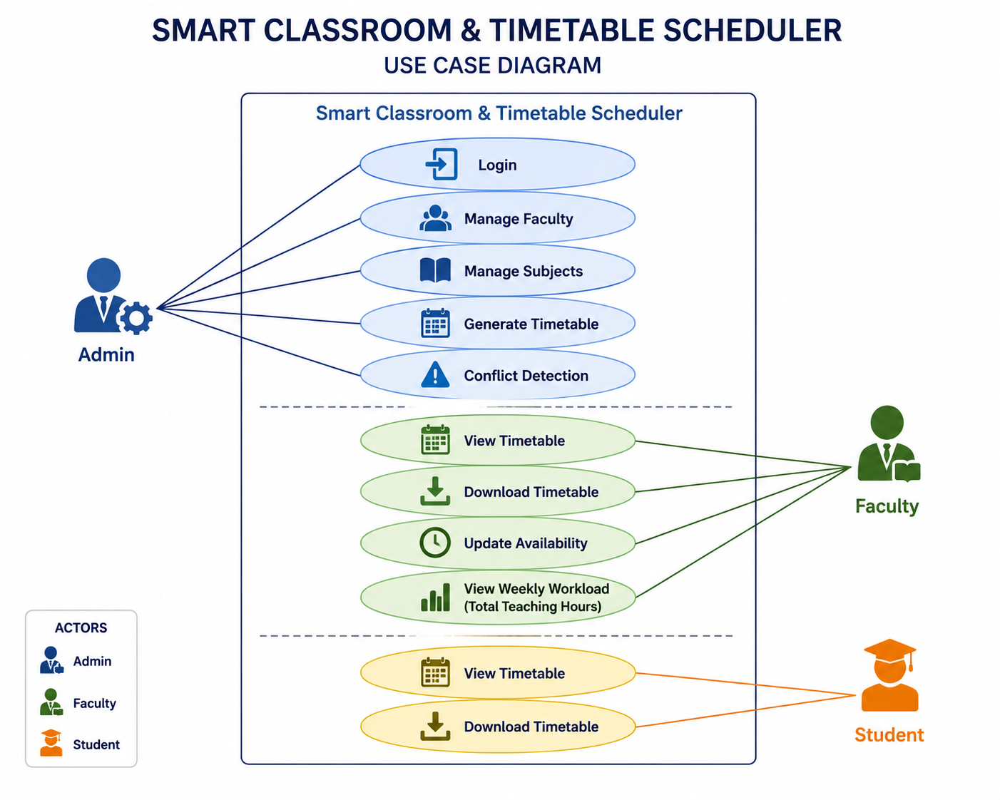
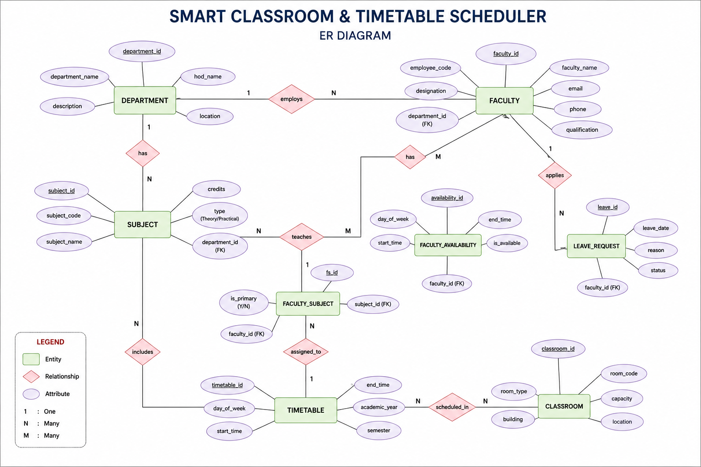

# SMART CLASSROOM & TIMETABLE SCHEDULER

## PROJECT OVERVIEW

🔸The Smart Classroom & Timetable Scheduler is a web-based system developed to simplify timetable management in educational institutions. It automates the process of scheduling classes, assigning faculty members, and managing subjects across multiple departments. The system helps reduce manual effort, improve scheduling accuracy, and provide easy timetable access for both students and faculty.

## PROBLEM STATEMENT

🔸Creating timetables manually is a time-consuming task in educational institutions. It may lead to faculty conflicts, classroom allocation issues, and scheduling errors. This project aims to automate timetable generation and efficiently manage faculty and classroom allocation. The system also detects conflicts and helps optimize resource utilization.

## OBJECTIVE

🔸 To automate the timetable generation process.

🔸 To avoid faculty scheduling conflicts.

🔸 To efficiently allocate classrooms and faculty members.

🔸 To reduce manual effort in timetable management.

🔸 To optimize the utilization of available resources.

## USER AND MODULE IDENTIFICATION

### USER

🔸Admin

🔸Faculty

🔸Student

### MODULES

🔸Login

🔸Faculty Management

🔸 Subject Management

🔸 Timetable Generation

🔸 Conflict Detection

🔸 Timetable View

## USE CASE DIAGRAM

🔸This diagram illustrates the system’s overall use case structure.



## TABLE LIST

🔸The following tables are used in the system database design:

| S.No | Table Name            | Purpose |
|------|-----------------------|---------|
| 1    | Department            | Stores department details |
| 2    | Faculty               | Stores faculty information |
| 3    | Subject               | Stores subject details |
| 4    | Faculty_Subject       | Maps faculty with subjects |
| 5    | Classroom             | Stores classroom details |
| 6    | Timetable             | Manages class schedule |
| 7    | Faculty_Availability  | Tracks faculty availability |
| 8    | Leave_Request         | Manages leave requests |
| 9    | Training_Course       | Stores training courses |
| 10   | Conflict_Log          | Records scheduling conflicts |

##  ER DIAGRAM

🔸This diagram represents the database structure and relationships between entities.


## SQL SCHEMA

### DEPARTMENT TABLE

```sql
CREATE TABLE department (
    department_id INT PRIMARY KEY,
    department_name VARCHAR(100)
);
```

### FACULTY TABLE

```sql
CREATE TABLE faculty (
    faculty_id INT PRIMARY KEY,
    faculty_name VARCHAR(100),
    department_id INT,
    FOREIGN KEY (department_id) REFERENCES department(department_id)
);
```

### SUBJECT TABLE

```sql
CREATE TABLE subject (
    subject_id INT PRIMARY KEY,
    subject_name VARCHAR(100),
    department_id INT,
    FOREIGN KEY (department_id) REFERENCES department(department_id)
);
```

### CLASSROOM TABLE

```sql
CREATE TABLE classroom (
    classroom_id INT PRIMARY KEY,
    room_number VARCHAR(20),
    capacity INT
);
```

### TIMETABLE TABLE

```sql
CREATE TABLE timetable (
    timetable_id INT PRIMARY KEY,
    faculty_id INT,
    subject_id INT,
    classroom_id INT,
    day VARCHAR(20),
    period INT,
    FOREIGN KEY (faculty_id) REFERENCES faculty(faculty_id),
    FOREIGN KEY (subject_id) REFERENCES subject(subject_id),
    FOREIGN KEY (classroom_id) REFERENCES classroom(classroom_id)
);
```

